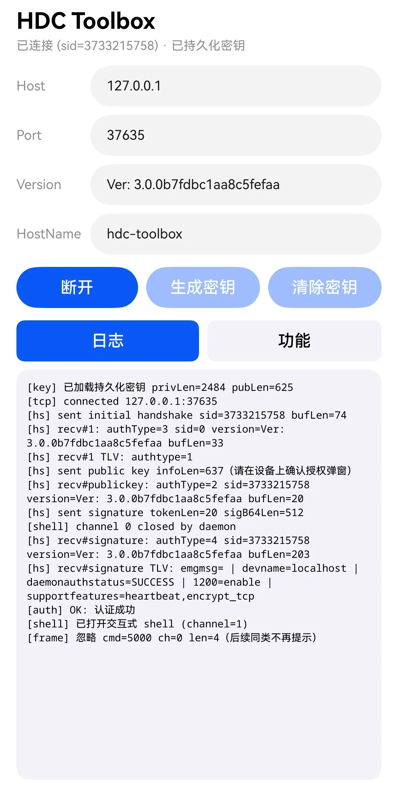
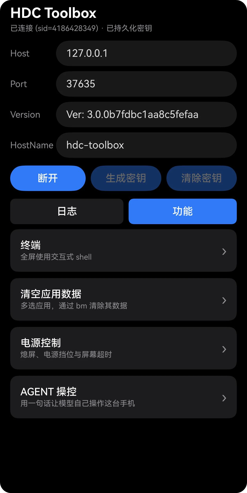

# HDC Toolbox

在手机上直接跑 HDC 客户端。本项目用 ArkTS 重写了 hdc 的无线调试协议，可连接任意hdcd，不需要电脑。

2.0 版本更新了「AGENT 操控」：把这套 shell 能力交给大模型，用一句话驱动它自己操作这台手机。

- 包名 `com.lee.hdc` · 版本 `2.0.0`
- HarmonyOS，`compatibleSdkVersion 6.1.0(23)` / `targetSdkVersion 6.1.1(24)`
- 仅手机，无第三方依赖

## 截图

<table>
<tr>
<td align="center" width="33%">

<br>主页 · 握手与鉴权日志
</td>
<td align="center" width="33%">

<br>功能页 · 深色主题
</td>
<td align="center" width="33%">

<br>AGENT 操控 · 浅色与深色
</td>
</tr>
</table>

## 为什么

`hdc` 官方只有 PC 端二进制。手机开了「无线调试」之后，hdcd 会在本机监听一个 TCP 端口 —— 那个端口对手机自己也是可达的。于是把 hdc 的握手、鉴权、shell 通道全部在 ArkTS 里实现一遍，应用就能以 shell 权限操作本机，也能连局域网里的另一台设备。

## 功能

| 入口 | 做什么 |
| --- | --- |
| 终端 | 交互式 shell，支持 Ctrl+C、流式输出、UTF-8 跨帧解码、回显模拟与宽列设置 |
| 安装 HAP | 系统选择器挑 .hap（或文件管理器里直接点开），经 FILE 通道传到所连设备 → `bm install -r` → 自动清理；本地/远程设备同一条路 |
| 清空应用数据 | 列出全部应用，多选后用 `bm clean` 清数据 |
| 电源控制 | 熄屏、电源挡位（普通/省电/性能/超级省电）、屏幕超时 |
| AGENT 操控 | 说一句要做什么，大模型自己看屏幕、点按滑动、拉起应用，直到做完 |

底层实现用的命令：

- 应用列表 `bm dump -a -l`，系统应用判定用 `xargs -P16` 在设备侧并发跑 `bm dump -n <pkg>`，判定结果缓存到 Preferences
- 清数据 `bm clean -n '<pkg>' -d`，包一层退出码 marker，非 0 直接抛错
- 装 HAP：FILE 通道（WAKEUP→CHECK→BEGIN→DATA(12288B/帧)→FINISH 握手，帧序列经真机探针验证）推到 `/data/local/tmp/<6位随机字母>.hap` → `bm install -r -p` → `rm -f`，传输/安装/清理各带独立结果上报
- 电源 `power-shell suspend` / `power-shell setmode 600..603` / `power-shell timeout -o <ms>` / `power-shell timeout -r`
- 每次改电源设置后回读 `hidumper -s PowerManagerService -a "-s"` 校验是否真的生效

### AGENT 操控

需要自己填一个 Anthropic 兼容的端点、API key 和模型名（设置页里填，存在应用沙箱）。填好之后在输入框说一句话，模型就开始自己干活。

给模型的 16 个工具，全部走 shell：

| 类别 | 工具 |
| --- | --- |
| 看 | `observe`、`screenshot`、`list_apps` |
| 点按 | `tap`、`click`、`long_press`、`double_tap` |
| 滑动 | `scroll`、`drag`、`draw` |
| 输入 | `input_text`、`key` |
| 其他 | `launch_app`、`wait`、`todo_write`、`done` |

几处值得说的实现：

- **前台守卫**：模型在跑时用户碰了手机就暂停，先用窗口 id 当便宜筛子，只有 id 变了才花一次完整观测
- **长时保活**：申请 `dataTransfer` 长时任务并发一条带进度的通知，划掉通知即停止。进 AGENT 页时会检查通知授权，没给就不开页面
- **可续聊、可取消、多会话**：每段对话存盘（时间线旁挂只追加的 `.timeline`），左右滑翻段；跑到一半可以取消在途命令，取消不算失败
- **上下文压缩**：按上游返回的真实上下文大小判断，触发时发一次请求让模型自己写交接说明，失败就停任务而不是机械截断

## 环境要求

- HarmonyOS 手机，实测 HarmonyOS 6.1.0
- 开发者选项里打开「无线调试」，记下它显示的端口号
- 首次连接需要在设备上点掉 hdc 授权弹窗
- 用 AGENT 操控还要：一个 Anthropic 兼容的端点与 API key、允许本应用发送通知

## 用法

1. 打开应用，Host 填 `127.0.0.1`（连本机）或对端设备 IP，Port 填无线调试端口
2. 点「生成密钥」生成并持久化 RSA-3072 密钥对（只需一次）
3. 点「连接」，设备弹出授权弹窗时确认
4. 切到「功能」页选终端 / 清空应用数据 / 电源控制 / AGENT 操控
5. 用 AGENT 前先进它的设置页填端点、API key 和模型名

Host、Port 和系统应用判定缓存会存到 Preferences，下次进来自动回填。AGENT 的端点、API key、模型名和历史对话也存在应用沙箱里。

## 目录结构

```
entry/src/main/ets/
├─ entryability/EntryAbility.ts     UIAbility：loadContent + 接收「点 .hap 打开」的 want.uri
├─ pages/Index.ets                  全部 UI（主页 + 终端/安装 HAP/清数据/电源/AGENT 五个全屏浮层）
├─ agent/
│  ├─ AgentLoop.ts                  一轮轮的对话循环、工具分发、上下文压缩
│  ├─ AnthropicClient.ts            SSE 流式解析、thinking 块原样回传、缓存标记
│  ├─ AgentTools.ts                 16 个工具的声明与系统提示词
│  ├─ Observer.ts                   界面树转带编号的元素表
│  ├─ DeviceControl.ts              每个动作对应的 shell 命令、取消与超时
│  ├─ AgentSession.ts               会话存盘，时间线旁挂只追加的 .timeline
│  ├─ AgentSettings.ts              端点、key、模型、上下文上限等设置
│  ├─ KeepAlive.ts                  dataTransfer 长时任务与进度通知
│  └─ TodoStore.ts                  模型自己写的计划与进度
└─ hdc/
   ├─ HdcTypes.ts                   协议常量与类型
   ├─ Bytes.ts                      ByteReader/ByteWriter、base64、hex、UTF-8
   ├─ Protocol.ts                   varint、protobuf 字段、TLV、组帧与拆帧
   ├─ HdcCrypto.ts                  RSA-3072 生成/导入、PSS 签名
   ├─ HdcKeyStore.ts                密钥 PEM 持久化
   ├─ HdcSettings.ts                连接参数与系统应用判定缓存
   ├─ HdcConnection.ts              TCP、握手鉴权状态机、帧路由
   ├─ HdcShellChannel.ts            交互式 shell 通道
   ├─ HdcFileChannel.ts             FILE 通道：向所连设备推文件（帧序列真机探针验证）
   ├─ TerminalEmulator.ts           80 列行式终端模拟：消化 mksh 重画回显的控制码
   ├─ HdcUnityCommandChannel.ts     一次性命令通道
   └─ BundleManager.ts              bm 封装：列表、系统应用分类、清数据、装 HAP 三段
```

## 已知限制

- 设备要求 `AUTH_ENCRYPT`（TLS-PSK 加密信道）时直接失败，未实现
- 命令输入框关不掉输入法自动大写，试过多种方案均无效
- UI 文案全部硬编码中文，没做多语言
- 私钥以 PEM 明文存在应用沙箱的 Preferences 里，依赖沙箱隔离，没有额外加密
- AGENT 的 API key 同样是明文存在沙箱里
- 息屏后能连续跑多久没测到底，只验证过 40 分钟内正常
- 没有录屏工具，动画类观感只能靠肉眼判断，无法自动回归

## 权限

| 权限 | 用途 |
| --- | --- |
| `ohos.permission.INTERNET` | 连 hdcd 的 TCP 端口，以及 AGENT 访问模型端点 |
| `ohos.permission.KEEP_BACKGROUND_RUNNING` | AGENT 跑长任务时申请 `dataTransfer` 长时任务，配合 `backgroundModes` 声明 |

另外 AGENT 需要运行时的通知授权：保活必然带一条进度通知，通知被禁用时既看不到进度、也没有「划掉即停止」这个入口，所以进 AGENT 页时会检查授权，没给就不开页面。
